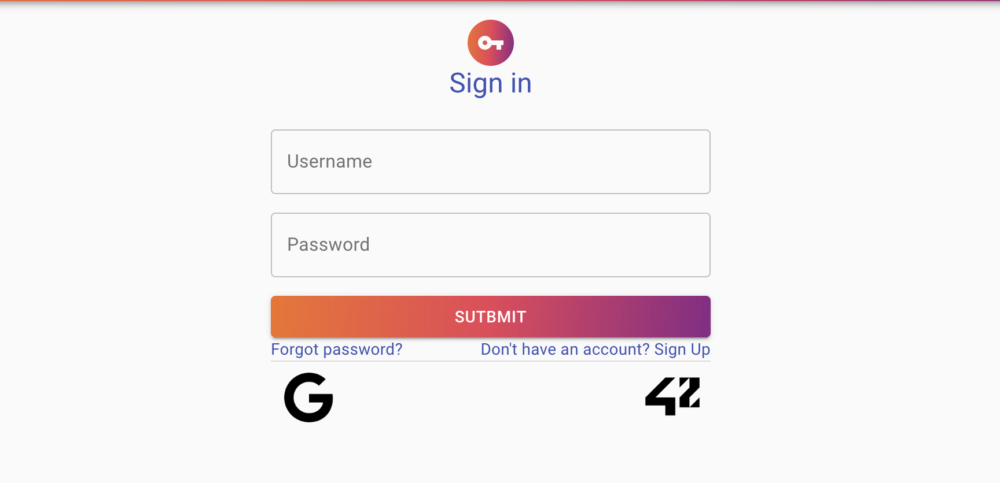
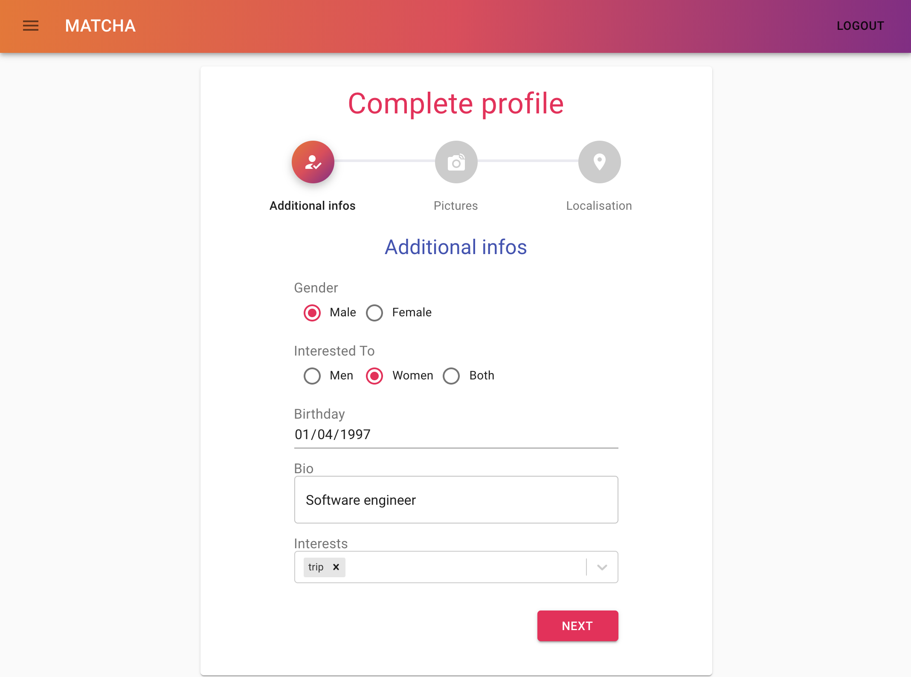
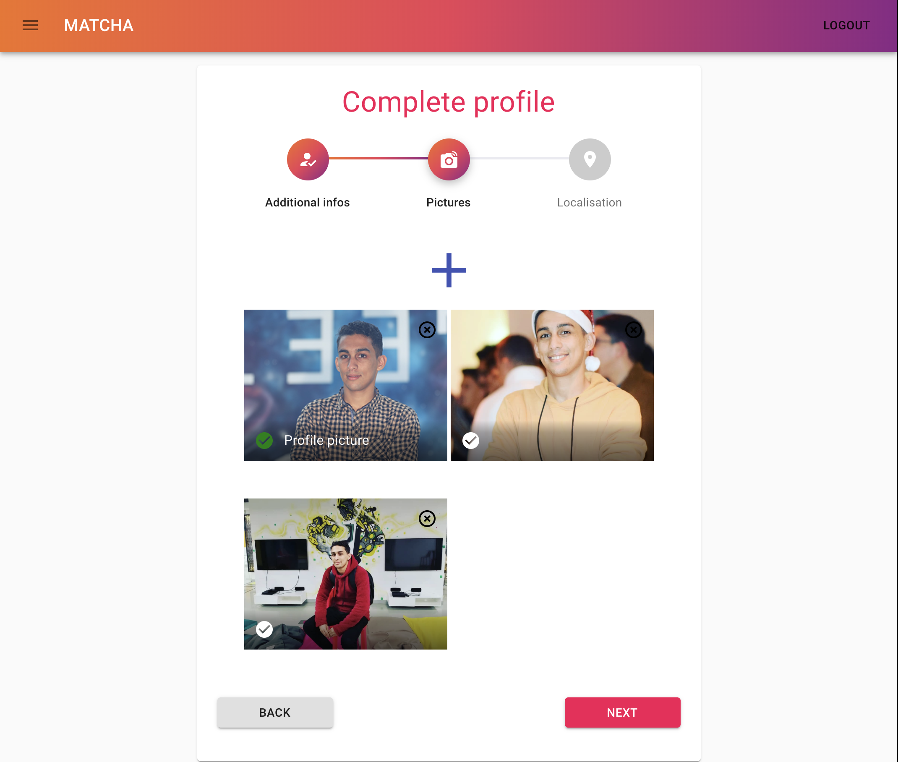
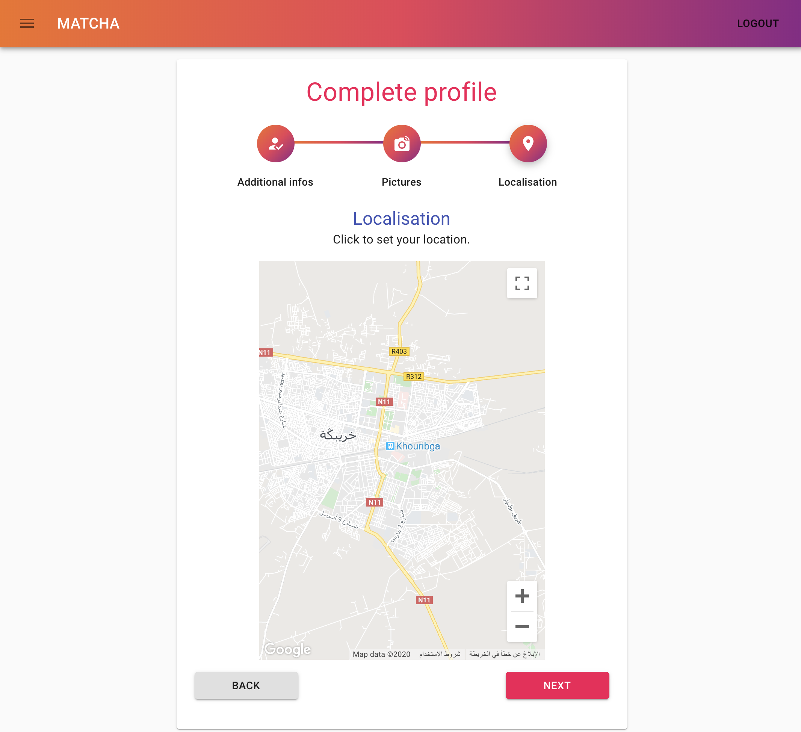
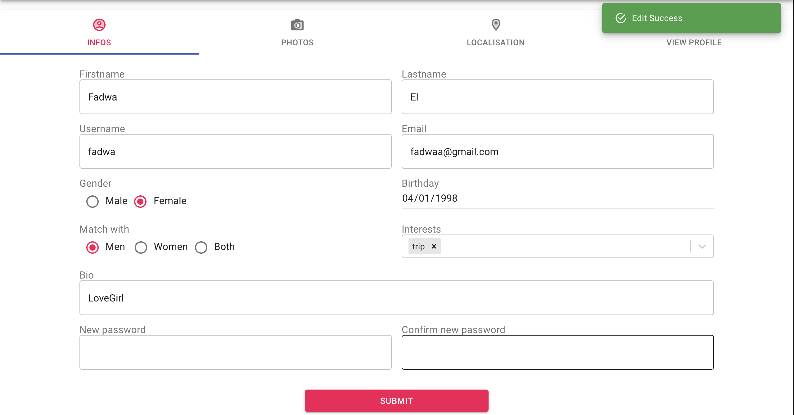
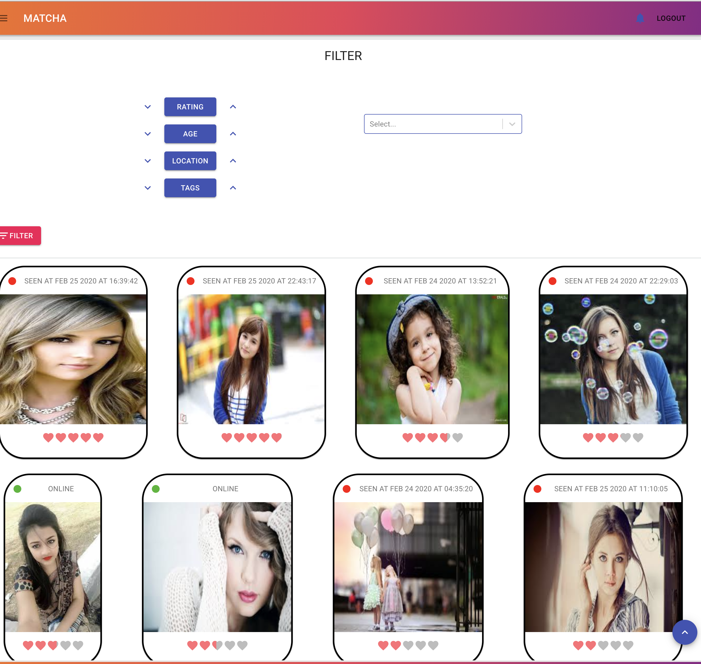
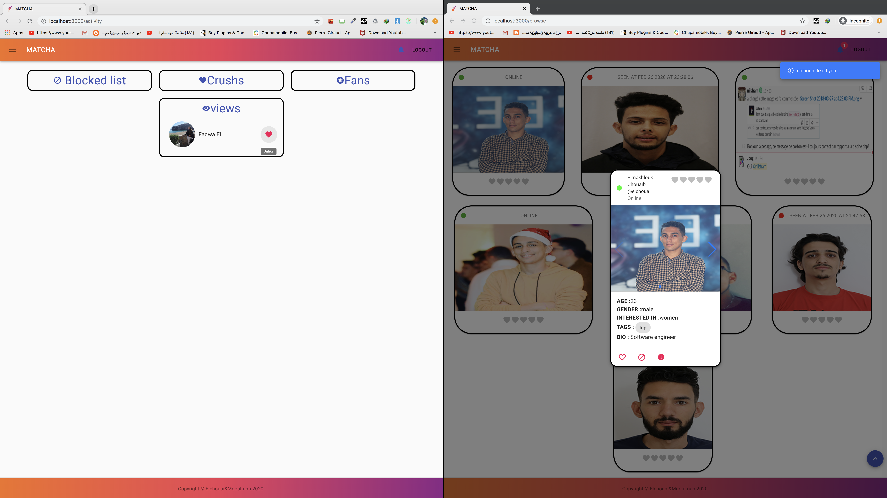
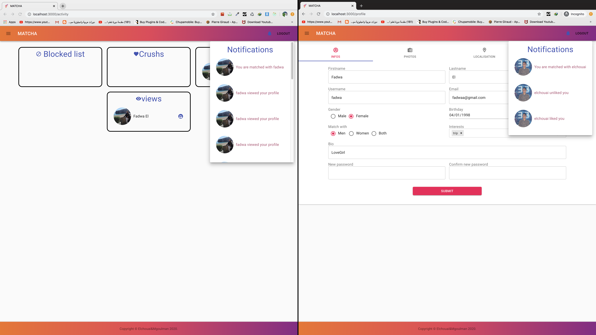
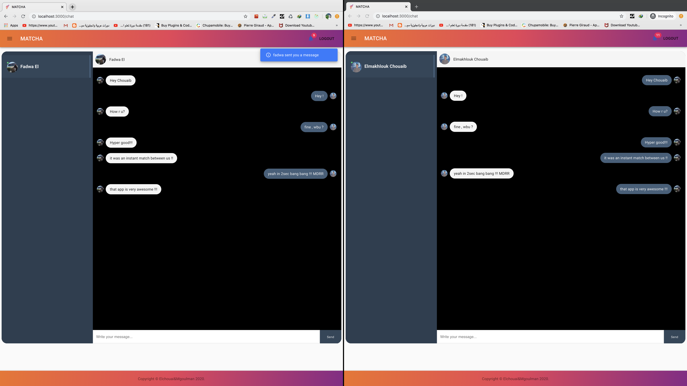

                         WELCOME TO OUR LOCAL VERSION OF TINDER

> # Matcha
Web Application for Matching Accounts and Dating.- 1337 school (42 network) project.

> # Description
The aim of this application is to match people with new friends according to many criteria.

After creating his account and completing his profile the user can search for other users by many criteria such as :
- age.
- distance.
- Score rating.
- Common tags

The users have the possibility to like, block or report fake accounts.

Two matched users can chat with each other.

> ## Back-end
- Node.js
- Express.js
- Socket.io
- MYSQL

> ## Front-end
- React.js (+hooks)
- Redux (+ Redux form, Redux-saga)
- Material-ui

> # How to run it ?
You must have phpmyadmin launched 

    cd client && npm install

    cd server && npm install

    cd server/config && and sh index.sh //to launch db migration

    cd server && npm run dev

    cd client && serve -s build -l [PORT]

> # You Don't have npm ?

    brew install npm
    
> # Screenshots

 - * Login 
 

 - * Adding informations related to the profile 
 

 - * Adding pictures of the user 
 

 - * precise the localisation using the map 
 

 - * editing the profile fields 
 

 - * browsing and filtring others users 
 

 - * view a profile 
 

 - * like and like back a profile 
 

 - * instant notifications 
 

 - * Chat 
 

Created By : 
- * ELMAKHLOUK Chouaib 
- * GOULMANE Mouad
